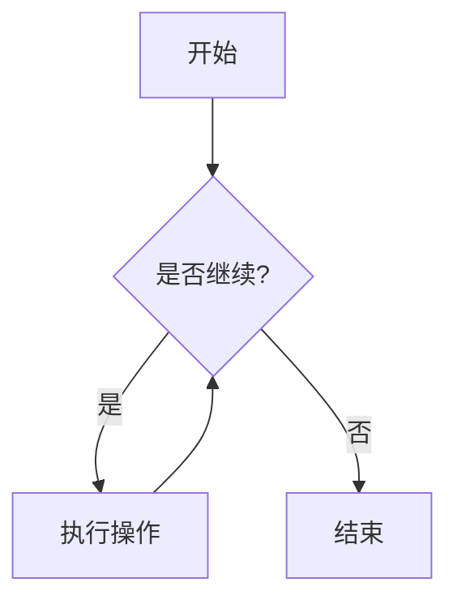
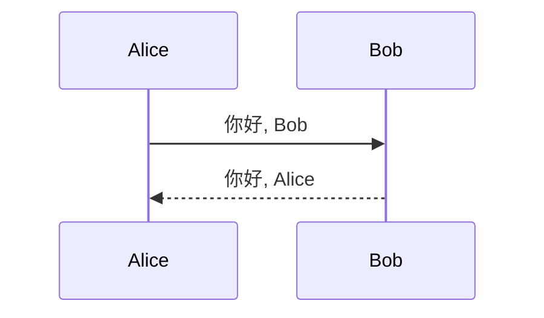

<!-- _class: lead -->
<!-- _paginate: false -->
<!-- _header: "" -->

# 🎨 Marp 全特性演示

## 从基础到高级

---

<!-- _header: "📐 基础语法" -->

# 标题层级

## 二级标题

### 三级标题

#### 四级标题

##### 五级标题

---

# 文本样式

**粗体** | *斜体* | ~~删除线~~ | `行内代码`

[超链接](https://marp.app)

> 这是一段引用文本，展示引用块样式。

---

# 列表与任务

- 无序列表项 1
  - 嵌套项 1.1
  - 嵌套项 1.2
- 无序列表项 2

1. 有序列表项 1
2. 有序列表项 2
   - 混合嵌套

- [x] 已完成任务
- [ ] 未完成任务
- [ ] 待办事项

---

# 代码块与高亮

```javascript
// 带语法高亮的代码
function greet(name) {
  console.log(`Hello, ${name}!`);
}
greet("Marp");
```

```python
def fib(n):
    return n if n < 2 else fib(n-1) + fib(n-2)
```

---

# 表格

| 特性         | 支持 | 备注          |
|--------------|------|---------------|
| 基础 Markdown | ✅   | 完全支持      |
| 主题切换     | ✅   | 内置/自定义   |
| 图表         | ✅   | 通过 Mermaid  |
| 数学公式     | ✅   | KaTeX / MathJax |

---

# 图片


*图片居中显示，支持 SVG 和位图*

---

<!-- _header: "📊 高级特性" -->

# 多列布局

<div class="columns">

**左列**
- 要点 1
- 要点 2
- 要点 3

**右列**
1. 步骤 A
2. 步骤 B
3. 步骤 C

</div>

---

# 数学公式（KaTeX）

行内公式: $E = mc^2$

块级公式:

$$
\begin{align}
\nabla \cdot \mathbf{E} &= \frac{\rho}{\varepsilon_0} \\
\nabla \times \mathbf{B} &= \mu_0 \mathbf{J} + \mu_0 \varepsilon_0 \frac{\partial \mathbf{E}}{\partial t}
\end{align}
$$

---

# Mermaid 图表





---

# 自定义样式

<span style="color: #e74c3c; font-size: 2rem;">彩色文字</span>

<span class="highlight">高亮背景</span>

<div style="background: #2c3e50; color: white; padding: 1rem; border-radius: 12px;">
  带背景色的卡片容器
</div>

---

# 分页控制

<!-- _paginate: false -->

这一页隐藏页码

<!-- _header: "" -->

无页眉页脚

---

<!-- _class: invert -->

# 反色主题

通过 `_class: invert` 切换为深色背景

- 白色文字
- 适合夜间演示

---

<!-- _header: "🖼️ 背景与定位" -->

# 背景图片


文字自动置于前景

---

<!-- _header: "" -->
<!-- _footer: "" -->
<!-- _paginate: false -->

# 背景图片 + 滤镜


<span style="color: white; font-size: 2.5rem;">亮度降低后文字更清晰</span>

---

<!-- _header: "📍 定位控制" -->

<!-- _footer: "右下角定位示例" -->

<div style="position: absolute; bottom: 100px; left: 50px; background: rgba(0,0,0,0.7); color: white; padding: 1rem;">
  绝对定位元素
</div>

正常流内容继续显示...

---

# 多页演示

---

<!-- _class: lead -->

# 谢谢观看

## Marp 让幻灯片创作更简单

---

<!-- _header: "" -->
<!-- _footer: "" -->
<!-- _paginate: false -->

# 附录：所有特性一览

- ✅ 基础 Markdown（标题、列表、链接、图片）
- ✅ 代码块与语法高亮
- ✅ 表格
- ✅ 数学公式（KaTeX）
- ✅ Mermaid 图表
- ✅ 自定义 CSS 样式
- ✅ 多列布局
- ✅ 背景图片与滤镜
- ✅ 页面类控制（lead, invert）
- ✅ 页眉/页脚/页码控制
- ✅ 绝对定位
- ✅ 主题切换