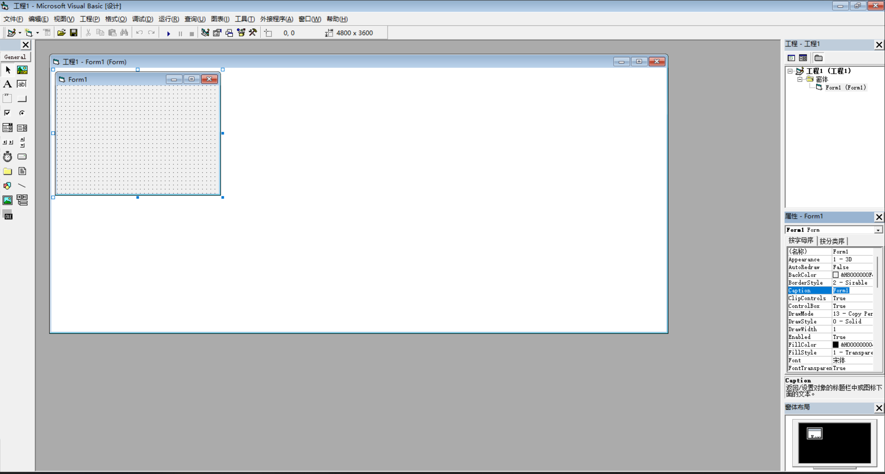

## 欢迎

这是 Chronicle Lite 的第一篇文章。

Chronicle Lite 是一个**纯静态、目录驱动**的博客系统。你只需要：

1. 在 `site/posts/` 下新建目录，放入 `index.md`
2. 在 `site/settings.yml` 中修改站点配置
3. 运行 `npx chronicle-gen build --site` 生成静态站点

## 特性

- **零数据库**：所有内容以 Markdown 文件存储
- **零后端**：构建产物为纯 HTML/CSS/JS，可部署到任意静态托管
- **Markdown 全面支持**：代码高亮、LaTeX 数学公式、Mermaid 图表
- **文件附件**：文章目录下的图片等文件会自动上传并重写引用路径

## 使用文章附件

把图片放在文章目录下，Markdown 中用文件名引用：

```markdown

```

效果：


转换时自动上传到 `data/upload/pic/` 并重写为服务器路径。
